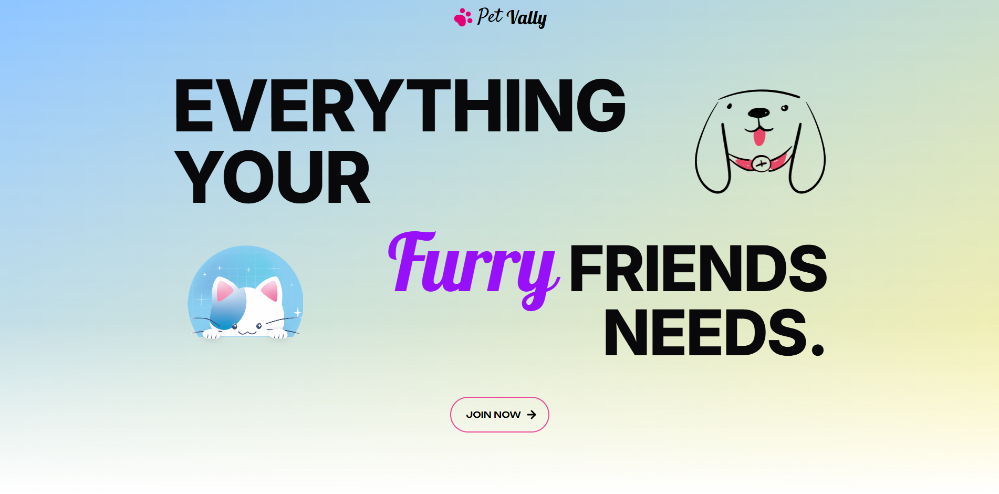

# PetVally - Next.JS

## About This Project

`Project for CSE 470 - Software Engineering`



We are Building a comunity of petowners and caregivers. More info will be added later......... :

PetVally is powered by AI to assist users with smart veterinary guidance. The platform offers features such as selecting and purchasing pet-related products, registering various types of pets, and creating announcements for lost pets.

Users can book appointments with veterinarians and engage in interactive consultations through an integrated AI assistant. In addition to managing pet needs, users can also publish posts to share updates, tips, or pet stories with the community.

## 🐾 Purpose of the Project

**PetVally** is a platform designed to build a community for pet lovers — whether you're a pet owner or a caregiver. It brings together essential services like pet adoption, donations, lost pet reporting, pet product listings, and AI-powered veterinary consultation.

The project also aims to:

- Help users report and find missing pets.
- Allow donations and pet adoption posts.
- Provide a platform for selling/buying pet-related products.
- Enable AI-assisted consultations with veterinary guidance.

### 💾 Tech Stack :

           
  

## 🚀 Getting Started

### 📦 1. Install Dependencies

Make sure you have **Node.js** and **npm** installed. Then run:

`npm install`

### ⚙️ 2. Create Your Own Environment File

Create your own .env file in the root directory.

Your .env file should look like this:

```bash
DATABASE_URL = your_database_url_here
JWT_SECRET = your_jwt_secret_here
CLOUDINARY_CLOUD_NAME = your_cloudinary_cloud_name
CLOUDINARY_API_KEY = your_cloudinary_api_key
CLOUDINARY_API_SECRET = your_cloudinary_api_secret
```

🛑 Never commit your .env file to version control.

### 🧪 3. Run the Development Server

`npm run dev`

### 🧩 4. Prisma & Seeding Database

#### 1. Update your schema and generate client

```bash
npx prisma db push
npx prisma generate
```

#### 2. Seed initial pet data

```bash
npx prisma db seed
```

#### 3. Swap seeding files for product data

Rename `seed.ts` → `seed-pet.ts`, and `seed2.ts` → `seed.ts`, then run:

```bash
npx prisma db seed
```

#### 4. Seed alternative dataset (e.g., donation products)

You can also run alternative seed logic:

```bash
npm run seed-alt
```

(Defined in `package.json` as a shortcut for executing `prisma/dont-seed-this.ts`.)

#### 5. Inspect your data

Use Prisma Studio to browse and verify seeded data:

```bash
npx prisma studio
```

Or view directly in your NeonDB dashboard.

Open your browser and visit for local development : [http://localhost:3000](http://localhost:3000)
